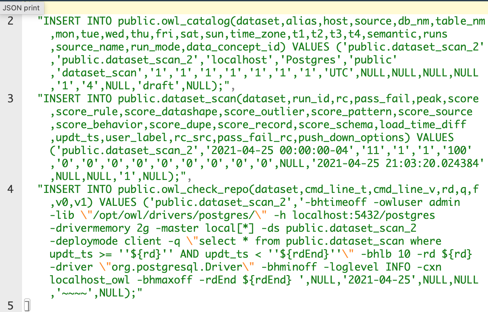

# Export and Import API


The database needs the [stored procedure](export-and-import-api.md#stored-procedure) (function) defined in order to use the Export/Import API. 


### Step 1 - Get-Exports

Best practice is to use the get-exports endpoint for most scenarios.  You can pass in several dataset names and several tables at once. This endpoint will create a JSON payload

**The three most common tables are:**

* owl_rule
* job_schedule
* owl\__check_repo_

```
http://<url>/v2/get-exports?dataset=public.dataset_scan_2,public.dataset_scan_1&schema=public&tables=owl_rule,job_schedule,owl_check_repo
```

#### Use Swagger to build this for you

This is located under controller-scala (internal API)

.png>)

#### Click Try it out to input the details

.png>)

### Step 2 - Run-Import


You will want to perform a find/replace on the import payload to check for differences in connections, agents, spark and environment configurations.  Migrating to different environments typically requires the payload to be modified.


Run import on the desired environment, passing the output of the previous statement to the body of the request 

```javascript
http://<url>/v2/run-import
```

#### Use Swagger to try it out 

This is under controller-catalog

.png>)

.png>)

This would be the body of the POST.



## Stored Procedure

The following function needs to be created in the Owl metastore before this can run. 

```
CREATE OR REPLACE FUNCTION public.dump(p_schema text, p_table text, p_where text)
 RETURNS SETOF text
 LANGUAGE plpgsql
AS $function$
 DECLARE
     dumpquery_0 text;
     dumpquery_1 text;
     selquery text;
     selvalue text;
     valrec record;
     colrec record;
 BEGIN

     -- ------ --
     -- GLOBAL --
     --   build base INSERT
     --   build SELECT array[ ... ]
     dumpquery_0 := 'INSERT INTO ' ||  quote_ident(p_schema) || '.' || quote_ident(p_table) || '(';
     selquery    := 'SELECT array[';

     <<label0>>
     FOR colrec IN SELECT table_schema, table_name, column_name, data_type
                   FROM information_schema.columns
                   WHERE table_name = p_table and table_schema = p_schema
                   ORDER BY ordinal_position
     LOOP
         dumpquery_0 := dumpquery_0 || quote_ident(colrec.column_name) || ',';
         selquery    := selquery    || 'CAST(' || quote_ident(colrec.column_name) || ' AS TEXT),';
     END LOOP label0;

     dumpquery_0 := substring(dumpquery_0 ,1,length(dumpquery_0)-1) || ')';
     dumpquery_0 := dumpquery_0 || ' VALUES (';
     selquery    := substring(selquery    ,1,length(selquery)-1)    || '] AS MYARRAY';
     selquery    := selquery    || ' FROM ' ||quote_ident(p_schema)||'.'||quote_ident(p_table);
     selquery    := selquery    || ' WHERE '||p_where;
     -- GLOBAL --
     -- ------ --

     -- ----------- --
     -- SELECT LOOP --
     --   execute SELECT built and loop on each row
     <<label1>>
     FOR valrec IN  EXECUTE  selquery
     LOOP
         dumpquery_1 := '';
         IF not found THEN
             EXIT ;
         END IF;

         -- ----------- --
         -- LOOP ARRAY (EACH FIELDS) --
         <<label2>>
         FOREACH selvalue in ARRAY valrec.MYARRAY
         LOOP
             IF selvalue IS NULL
             THEN selvalue := 'NULL';
             ELSE selvalue := quote_literal(selvalue);
             END IF;
             dumpquery_1 := dumpquery_1 || selvalue || ',';
         END LOOP label2;
         dumpquery_1 := substring(dumpquery_1 ,1,length(dumpquery_1)-1) || ');';
         -- LOOP ARRAY (EACH FIELD) --
         -- ----------- --

         -- debug: RETURN NEXT dumpquery_0 || dumpquery_1 || ' --' || selquery;
         -- debug: RETURN NEXT selquery;
         RETURN NEXT dumpquery_0 || dumpquery_1;

     END LOOP label1 ;
     -- SELECT LOOP --
     -- ----------- --

 RETURN ;
 END
 $function$
;
```

This assignment needs added.

```
alter function dump(text, text, text) owner to ownername;
```
