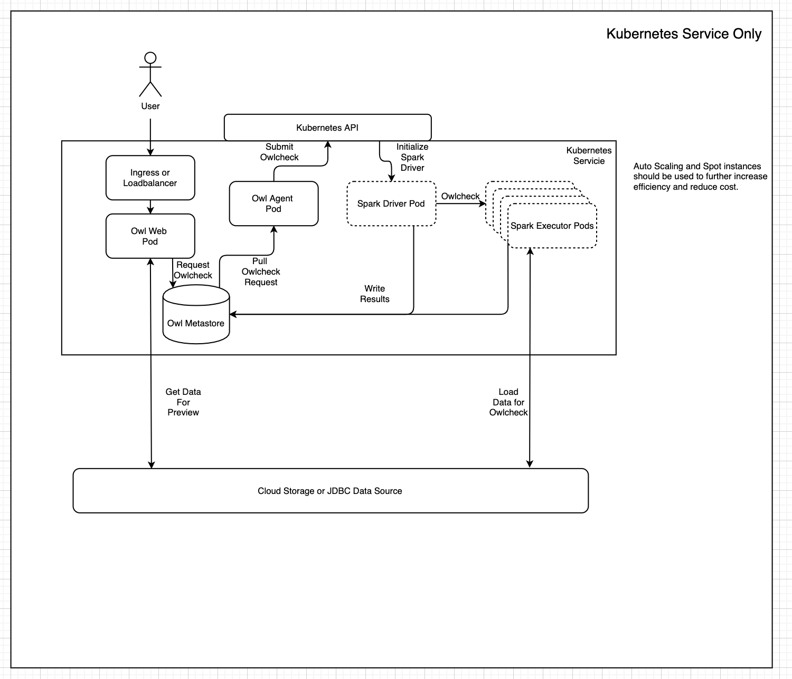

# Cloud Native OwlDQ

## Introduction to Cloud Native Architecture

According to Cloud Native Computing Foundation \(“CNCF”\) Charter:

Cloud native technologies empower organizations to build and run scalable applications in modern, dynamic environments such as public, private, and hybrid clouds. Containers, service meshes, microservices, immutable infrastructure, and declarative APIs exemplify this approach.

These techniques enable loosely coupled systems that are resilient, manageable, and observable. Combined with robust automation, they allow engineers to make high-impact changes frequently and predictably with minimal toil.

OwlDQ wholeheartedly embraces these principles in its design and deployment. The diagram below depicts OwlDQ's Cloud Native Deployment architecture:



In this "form factor", OwlDQ can be deployed in any public or private cloud while maintaining a consistent experience, performance, and management runbook. 

### OwlDQ Microservices

To achieve Cloud Native Architecture, OwlDQ is decomposed into several components, each of which is deployed as a microservice in a container.

* **Owl Web** - The main point of entry and interaction between OwlDQ and end users/integrated applications. Owl Web provides both a rich, interactive user experience and a robust set of APIs for automated integration.
* **Owl Agent** - The Agent can be thought of as the "foreman" of OwlDQ. When a user or application requests a data quality check through Owl Web, Owl Agent will marshal compute resources to perform the work. Owl Agent does not actually do any of the data quality work. Instead, it translates the request submitted to it from Owl Web into a technical descriptor of the work that needs to be done and then launches the requested DQ job \(Owlcheck\).
* **Owl Metastore** - This is where all of the metadata, statistics, and results of Owlchecks are stored. It is also then main point of communication between Owl Web and Owl Agent. Results of Owlchecks performed by transient containers \(workers\) in the compute space are written to the metastore.
* **History Server** - OwlDQ relies on Apache Spark to actually scan data and perform the bulk of data quality activities. In order to facilitate troubleshooting and performance tuning of Owlchecks, OwlDQ and instance of Spark History Server to enable easy access to Spark logs.
* **Spark** - Apache Spark is the distributed compute framework that powers OwlDQ's data quality engine. Spark enables Owlchecks to rise to the task of data quality on Terabyte scale datasets. Spark containers are completely ephemeral and only live for as long as necessary to complete a given Owlcheck.

### Containerization

The binaries and instruction sets described in each of the OwlDQ microservices are encompassed within Docker container images. Each of the images is versioned and maintained in a secured cloud container registry repo. In order to initiate an OwlDQ Cloud Native deployment, it is first necessary to obtain credentials to either pull the containers directly or download them to a private container registry. 

### Kubernetes

Kubernetes is a distributed container scheduler and has become synonymous with Cloud Native architecture. While Docker containers provide the logic and runtime at the application layer, most applications still require network, storage, and orchestration between multiple hosts in order to function. Kubernetes provides all of these facilities while abstracting away all of the complexity of the various technologies that power the public or private cloud hosting the application. 

### OwlDQ Helm Chart

While Kubernetes currently provides the clearest path to gaining the benefits of a Cloud Native architecture, it is also one of the more complex technologies in existence. This has less to do with Kubernetes itself and more with the complexity of the constituent technologies it is trying to abstract. Technologies like attached distributed storage and software defined networks are entire areas of specialization that require extensive expertise to navigate. Well implemented Kubernetes platforms hide all of this complexity and make it possible for anyone to leverage these powerful concepts. However, a robust application like OwlDQ requires many descriptors \(K8s Manifests\) to deploy its various components and all of the required supporting resources like network and storage.

This is where Helm comes in. Helm is a client side utility \(since V3\) that automatically generates all of the descriptors needed to deploy a Cloud Native application. Helm receives instructions in the form of a "Helm Chart" that includes templated and parameterized versions of Kubernetes Manifests. Along with the Helm Chart, the user can also pass in arguments like names of artifacts, connection details, enable/disable commands, ect. Helm resolves the user defined parameters within the Manifests and submits them to Kubernetes for deployment. This enables the user to deploy the application without necessarily having a detailed understanding of the networking, storage, or compute that underpins the application. 

For Example, the command below deploys the OwlDQ with all of the components depicted in the above diagram into Google Kubernetes Engine with Google Cloud Storage as the storage location for Spark logs. The only perquisite is that the image pull secret \(credential to access container registry\) and secret containing credentials for a service account with access to GCS is already deployed to the namespace.

```
helm upgrade --install --namespace <namespace> \
--set global.version.owl=<owl-version> \
--set global.version.spark=<owl-spark-version> \
--set global.configMap.data.license_key=<owl-license-key> \
--set global.spark_history.enabled=true \
--set global.spark_history.logDirectory=gs://logs/spark-history/ \
--set global.cloudStorage.gcs.enableGCS=true \
<deployment-name> \
/path/to/chart/owldq
```


The full universe of possible customizations is quite extensive and provides a great deal of flexibility in order to be applicable in a wide variety of platforms. However, as stated above, when deploying on a known platform \(EKS, GKE, AKS\), the number of required inputs is quite limited. In common cases, the user simply runs a single CLI command including basic parameters like disable history server, configure the storage bucket for logs, specify the image repo, ect. 



