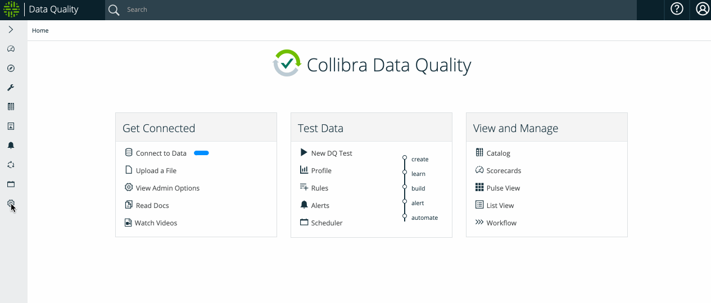
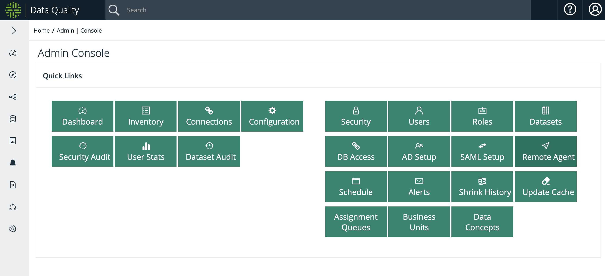
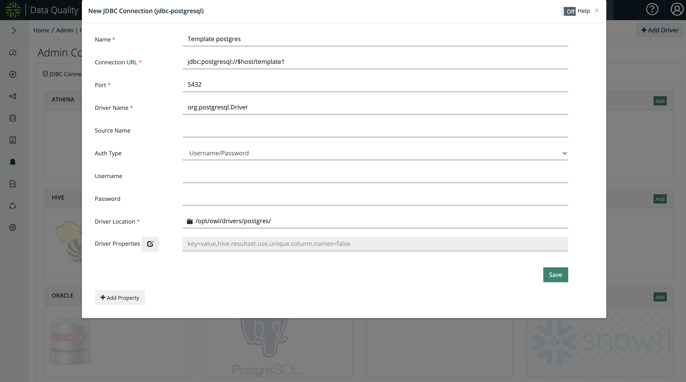

# Add a Connection

## How to Add DB Connection via UI

We will add a connection named `metastore` that connects to local Postgres server (`localhost:5432/postgres`)

* Login to DQ Web and navigate to Admin Console.

* From the Admin Console, click on the Connections tile.

* Click on Add button in Postgres box to add a Postgres connection

Default Postgres JDBC template connection is shown. This modal is populated with basic values what Postgres connection setting should look like.

Replace the Connection URL to point to the Postgres server you want to run DQ Jobs against. In this example, `jdbc:postgresql://localhost:5432/postgres`

Also change Driver Location to the JDBC Driver for Postgres in your installation. Click on the folder icon and click on Postgres driver path. These Driver Directories are default JDBC Drivers provided by DQ installation (usually in `$OWL_BASE/owl/drivers/*`)

Fig 6 is what the new connection setting should look like. Make sure to provide the correct Postgres Username and Password (if using Username/Password for authentication). Press Save to continue. _**This action will attempt to establish a connection.**_

### Link Connection to Agent


Make sure to [Link DB Connection](https://docs.owl-analytics.com/installation/agent-configuration#how-to-link-db-connection-to-agent-via-ui) to a DQ Agent, if required


