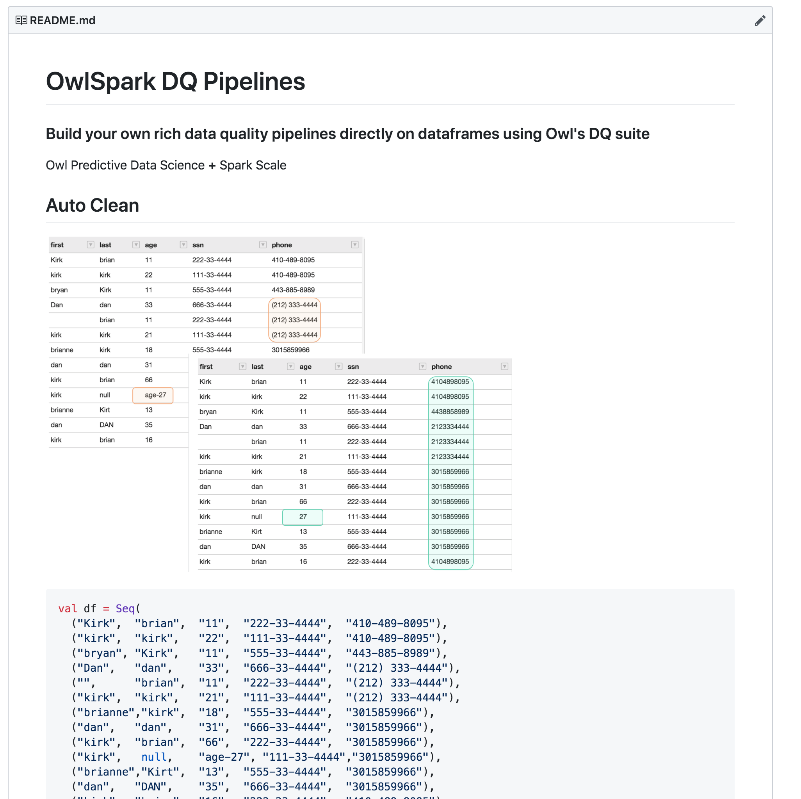

# Spark - DQ Pipeline

## Programmatic Owl

Don't like leaving your notebook? Want to build Owl into your in-house data quality pipeline? Owl can do both!

### Real World Examples

### Rules

Let's assume we were provided a file named "atm_cust_file" and want to load it into a database table as well as scan it for all possible errors.  We want to provide a couple levels of protection. 1) A business rule checking if _a customer joined before before the company was founded_.  2) Check if the file 100% matches to the DataFrame or db table we've created.  3) Check for all possible outliers or anomalies in the dataset.  Each one of these 3 issues had a different impact to the business and causes a different flow to trigger in our pipeline.     

#### Add Rule

Let's create a simple rule and assign points to the overall scoring system for later delegation. 

```scala
    val rule = new domain2.Rule
    rule.setRuleNm("customer_before_company")
    rule.setRuleValue("customer_since_date < '1956-11-01'")
    rule.setPerc(1.0)
    rule.setPoints(1)
    rule.setIsActive(1)
    rule.setUserNm("Kirk")
    rule.setDataset("ATM_CUSTOMER3")
    Util.addRule(rule=rule)
```

Now let's chain together the remaining 2 items that were part of our original requirement.  Note that Owl has 6 additional ML DQ features that we did not turn on in this case.

```scala
val owl = Util.OwlContext(df, atmCustFile, props)

// first register with catalog if not registered
owl.register(props)

// Check if dataframe matches the source file 'atm_cust_file'
val source = owl.validateSrcDF
if (source.count() > 1) {
  // create service now ticket and exit with fail based on not matching to original file
}

owl.addAdHocRule(rule)  
val ruleBreaks = owl.rulesDF
if (ruleBreaks.count() > 1) {
  if (ruleBreaks.where($"score" > 5).count > 1) {
    // create service now ticket and exit with fail based on rules
  }
}

val outliers = owl.outliersDF
if (outliers.where($"confidence" < 10).count > 3) {
  // Owl email Alert to business group for attention
  // where 3 outliers have a confidence below 10
}
```

### Ingesting Intraday Files

Here we illustrate an example of how to work with files when using Owl programmatically. This can be implemented in both a Notebook setting and in your own codebase.

```scala
  ///////////////////////////////////////////////////////////////////////////
    //                  USE CASE - Ingesting Intraday Files                  //
    ///////////////////////////////////////////////////////////////////////////

    // Part of your pipeline includes the ingestion of files that have the date
    // and hour encoded in the file name. How do you process those files using Owl?
    //
    // Format: <name>_<year>_<month>_<day>.csv
    //
    // Build up a data structure containg the files you want to process (here we
    // just use a simple list, but you may want to be pulling from a pubsub
    // queue, AWS bucket, etc...). Here we just use a simple file list of 6
    // hours of trade position data.
    val position_files = List(
      new File(getClass.getResource("/position_file_2019_11_03_08.csv").getPath),
      new File(getClass.getResource("/position_file_2019_11_03_09.csv").getPath),
      new File(getClass.getResource("/position_file_2019_11_03_10.csv").getPath),
      new File(getClass.getResource("/position_file_2019_11_03_11.csv").getPath),
      new File(getClass.getResource("/position_file_2019_11_03_12.csv").getPath),
      new File(getClass.getResource("/position_file_2019_11_03_13.csv").getPath),
      new File(getClass.getResource("/position_file_2019_11_03_14.csv").getPath))

    // Create your spark session.
    val spark = SparkSession.builder
      .master("local")
      .appName("test")
      .getOrCreate()

    // Configure Owl.
    val opt = new OwlOptions
    opt.dataset = "positions"
    opt.load.delimiter = ","
    opt.spark.master = "local[1]"
    opt.dupe.on = true
    opt.dupe.include = Array("ticker", "cid")
    opt.outlier.on = true
    opt.outlier.key = Array("cid")
    opt.outlier.timeBin = TimeBin.HOUR
    // Customize this to only process a subset of the data.
    opt.load.fileQuery = "select * from dataset"

    position_files.foreach { file: File =>
      // Tell Owl where to find the file.
      opt.load.filePath = file.getPath

      // Parse the filename to construct the run date (-rd) that will be passed
      // to Owl.
      val name = file.getName.split('.').head
      val parts = name.split("_")
      val date = parts.slice(2, 5).mkString("-")
      val hour = parts.takeRight(1).head

      // Must be in format 'yyyy-MM-dd' or 'yyyy-MM-dd HH:mm'.
      val rd = s"${date} ${hour}"

      // Tell Owl to process data
      opt.runId = rd

      // Create a DataFrame from the file.
      val df = OwlUtils.load(opt.load.filePath, opt.load.delimiter, spark)

      // Instantiate an OwlContext with the dataframe and our custom configuration.
      val owl = OwlUtils.OwlContext(df, spark, opt)

      // Make sure Owl has catalogued the dataset.
      owl.register(opt)

      // Let Owl do the rest!
      owl.owlCheck()

    }
```

.png>)

### All Pipeline Activities in 1 Line

For brevity and convenience Owl allows a DF to be loaded in the constructor and in 1 line run all 9 dimensions of data quality "owl.owlcheck".  To adjust the DQ dimensions you simply set the properties in the props object.   

```scala
val owl = Util.OwlContext(df, atmCustFile, props)
owl.owlCheck
```

#### Example of some common property settings

```scala
val props = new Props()
props.filePath = s"${filePath}/atm_customer_${rd.replace("-","_")}.csv"
props.runId = rd
props.dateCol = "OWL_RUN_ID"
props.dataset = "ATM_CUSTOMER3"
props.del = ","
props.datasetSafety = false
props.calculateBoundaries = true
props.fileLookBack = true
props.timeBin = "DAY"

// outlier, missing records
props.dl = true
props.dlKey = "customer_id"
props.dlLb = 4

// pattern mining
props.freqPatternMiningByKey = true
props.fpgKey = "customer_id"
props.fpgLookback = 4
props.fpgDateCol = "OWL_RUN_ID"
props.fpgCols = "card_number,first_name,last_name,checking_savings"
props.fpgLowFreq = true

// validate Src
props.validateSrc = true
props.valSrcKey = "customer_id"

// fuzzy match
props.isDupe = true
props.dupeCutOff = 88
props.depth = 3
props.dupeExcludeCols = "customer_id,card_number,customer_since_date,OWL_RUN_ID"
```



### Using Notebooks to build DQ Pipelines

For examples on how to do this, see our Notebook repository below.



##
