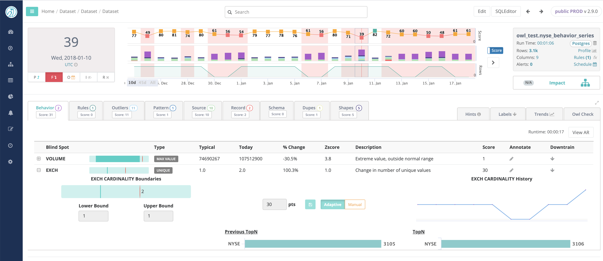
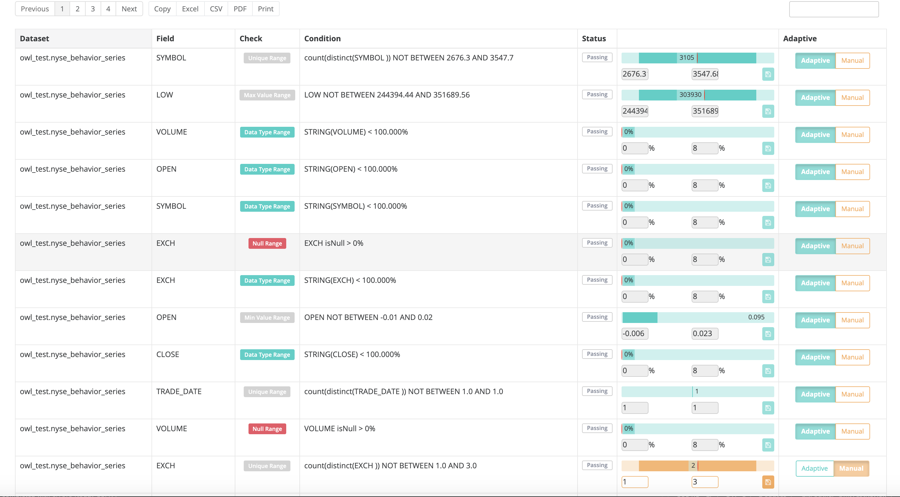

# Observability (automatic)


Results are found under the Behavior tab (short for behavioral analytics).  The adaptive rules modal will display a complete list of monitoring types and criteria.


## Evolution of Rule based Data Quality

The main goal of OwlDQ is to provide enterprise data quality insight while greatly reducing the volume of Rules that need to be written manually. When a dataset is brought under management, Owl profiles the data and builds a model for each dataset. This allows Owl to learn what "normal" means within the context of each dataset. As the data changes, the definition of "normal" will change as well. Instead of requiring the user to adjust rule settings, Owl continues to adjust its model. This approach enable Owl to provide automated, enterprise grade DQ coverage that removes the need to write dozens or even hundreds of rules per dataset.


Behaviors is turned on by default.  Monitoring will calibrate and detect DQ observations, based on the profiling activity. 


## Using Behavioral Analytics (Change Detection)

Typically, data quality checks are scheduled to run on a given dataset daily. Behavior DQ or simply put change detection, is built on top of data calculated by the Profile activity. The default settings will often work just fine, however, Owl allows the user to specify two key parameters:

* Behavior Lookback - Number of Owlchecks that model will encompass. Lookback of 10 means that the model will be based on the combined statistics from the last 10 Owlchecks of this dataset. 
* Learning Phase - Minimum number of Owlchecks before the Behavior model should begin to apply. Owl will not attempt to apply Behavioral scoring to a dataset until at least this many Owlchecks have been run on it.
* Applicable Behavioral  Factors - The user can choose to forego the application of any of the above factors to the scoring of the model. For example, the user can instruct Owl to not track MIN and MAX ranges of values in columns by unchecking the MIN and MAX checkbox. This would prevent Owl from detecting any extreme values in any column of the dataset using the Behavioral model.

With each run, Owl will profile the dataset at the column level and begin to establish a model for the dataset. Initially, there is no need for any manual intervention, just keep the data coming. Within a few runs, the model will become sufficiently robust to begin detecting data quality issues that would otherwise be covered by manual rules. For example, Owl may detect that particular column experienced a spike in the number of NULL values (typical manually defined rule). 


 Owl's behavioral model consist of the following factors:

* NULL values
* Empty values
* Cardinality
* Datatype shifting
* Row counts
* Load time
* Minimum Value
* Maximum Value
* Mean Value \[New Feature]


Over time, the definition of normal for any given column within the dataset can change. The data may legitimately become more sparse or decrease in volume. Owl will continue to learn and adjust the model throughout the life of the dataset. However, if there is a drastic (but legitimate) change in the data, this could still mean several days of unnecessary alerts while the model is adjusting. To accelerate model adjustment, Owl provides the ability to adjust the acceptable range that for a given behavioral finding. 

For example, Owl learned that a particular column typically has between 10% and 20% Empty values. Today, the column is 80% Empty values. Owl raises a data quality issue and subtracts a proportional amount or points from the quality score of today's DQ run. The user may review the finding and realize that there is a legitimate business reason why that column has more empty values. With a few clicks, the user adjusts the acceptable range for that finding. Owl incorporates the user defined inputs into the model and adjust the current day's quality score. Owl would have eventually arrived at the correct range without any input, but without user input, it may have taken a few runs get there.

#### Drill-in to see the predicted range of valid values

Automatic flagging of break records with erroneous data.

.png>)

The screenshot above shows some of the controls and visualizations that can be used to tune the Behavioral model. In this specific example, Owl has detected that the cardinality of the EXCH field has doubled from 1 to 2 unique values. However, a user can instruct Owl to disregard this finding and adjust the model by manually specifying the range of values acceptable in this column.  To assist the user, Owl provides a line chart and a historical topN visualization of this column's cardinality.

If the user wants to instruct Owl that there can be as many as 3 valid values in the EXCH column, the user click the "Manual" button and adjust the upper bound from 1 to 3, then click the save button. 

Owl will adjust the Behavioral model's baseline, remove the the finding, and adjust the quality score. Going forward, Owl will know the acceptable range for unique values in the EXHC column is between 1 and 3. 

## Adaptive Rules

As Owl builds and evolves the behavioral model, it will expose all of the "Adaptive Rules" that it is learning about. The above example demonstrates how Owl learns and automatically applies rules. The user has control but if left alone, Owl will learn what what "Normal" means for a given dataset and score quality of that dataset accordingly. This will result in a large set of rules that are automatically applied and adapted as the dataset changes over time.

To view or modify Adaptive Rules, navigate to the Behavior tab on the "Hoot" page for the desired dataset and click the "View AR" button on the right side of the screen. This will bring up a full list of Adaptive Rules. 

The Adaptive Rules also provides the user with the ability to adjust ranges derived from the behavior model. The user can manually adjust the tolerance range ad well as the score of any Adaptive Rule. While this may at times be convenient, it is also just fine to let Owl handle the model tuning through its own learning process.

### Scoring

In adaptive mode Owl automatically generates a DQ item score based on the egregiousness of the line item.  This measurement is directly proportional to the distance from the green range to the red line.  Example below.

The score can range from 0-30.  This ties to the percent change and Z-Score.  In cases when the Z-Score ranges from 0.0 - 6.0.
