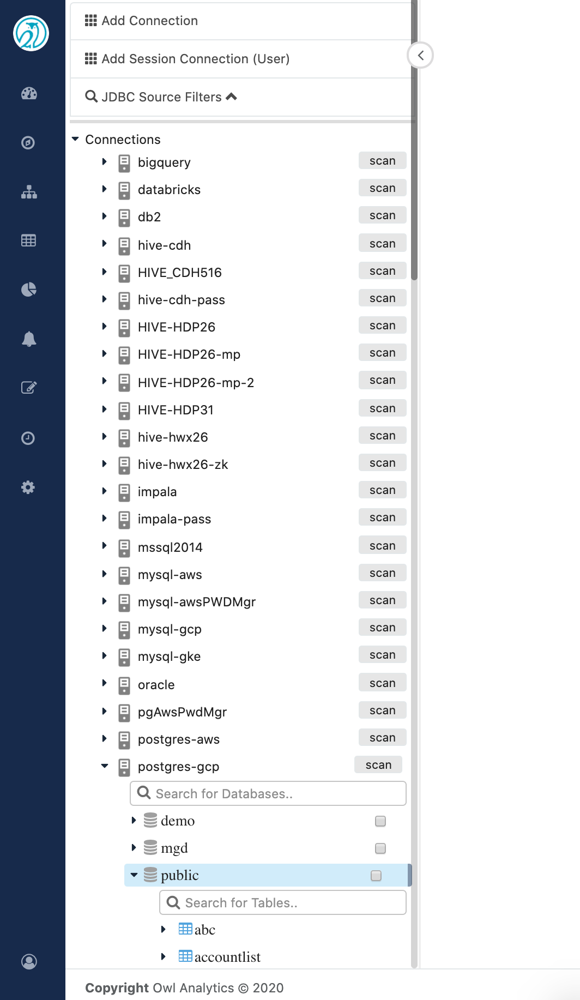
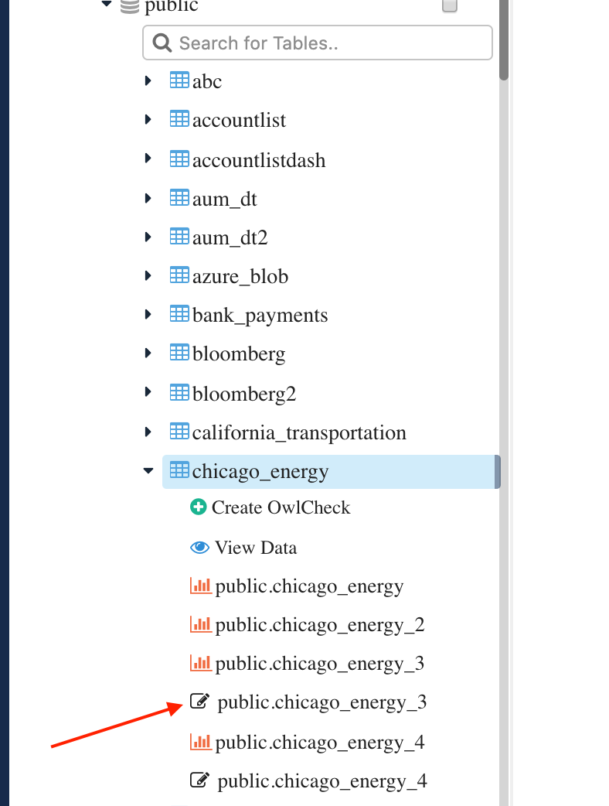
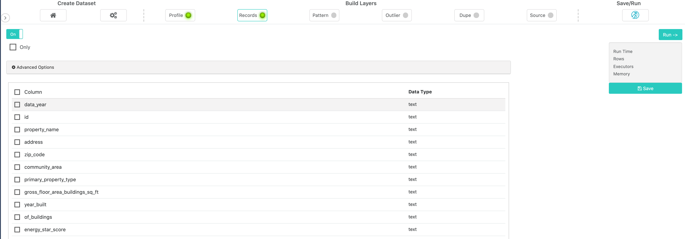
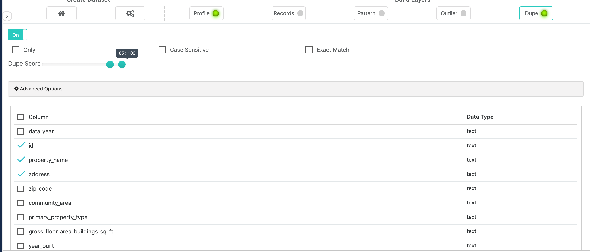
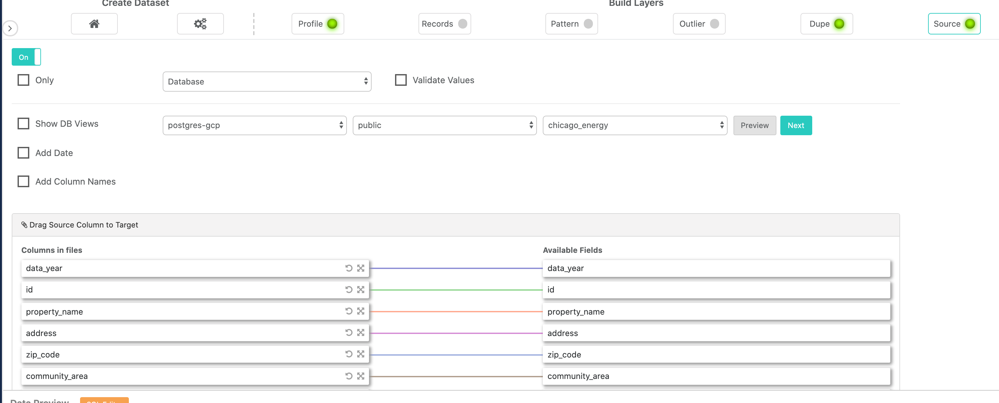
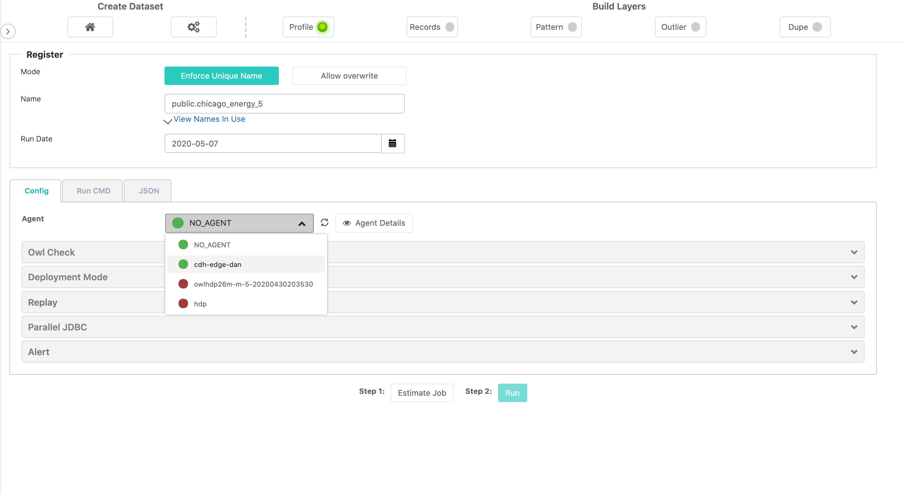

# Explorer 2

## Getting Started

This page can be accessed by clicked the Explorer option, within the compass icon 


This is being released as a tech preview and supports JDBC sources


## Select Your Data Source

## Create a new OwlCheck by clicking +Create OwlCheck

#### **View Data is an interactive option to run queries and explore the data**

#### The bar chart icon will take you to a profile page of the dataset created prior to Explorer 2 

## Select The Scope and Define a Query

#### Pick Date Column if your dataset contains an appropriate time filter 

#### Click Build Model -> to Save and Continue 

## Transform Tab (optional)

#### Click Build Model -> to Save and Continue 

## Profile

#### Click Save to and Click Records to Continue 

## Records

#### This should be applied to low cardinality columns 

#### Click Save to and Click Pattern to Continue 

## Pattern (optional)

Toggle on Pattern to enable this layer

Click +Add to define a group and series of columns 

#### Click Save to and Click Outlier to Continue 

## Outlier (optional)

#### Click Save to and Click Dupe to Continue 

## Dupe (optional)

#### Click Save to and Click Source to Continue 

## Source (optional)

Navigate to the source dataset

Click Preview to interlace the columns

Manually map the columns by dragging left to right or deselect columns 

#### Click Save to and Click Save/Run to Continue 

## Run

Select an agent

\*Note if you do not see your agent, please verify the agent has been assigned to your connection via:

_Admin Console-->Remote Agent--> (Link icon on far right)-->Map connections to this agent and then reload the explorer page_

Click Estimate Job

Click Run to start the job

## ****
