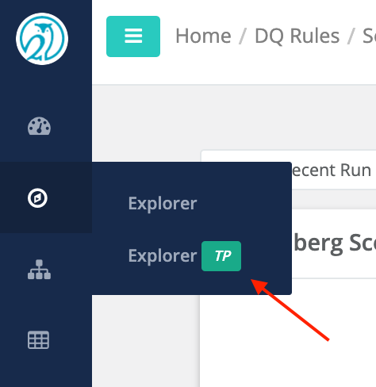
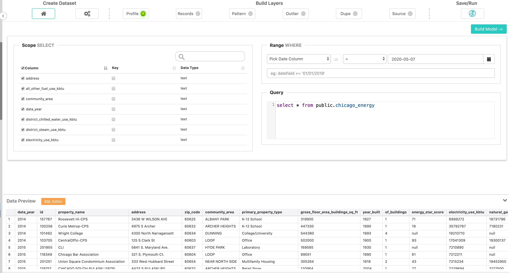
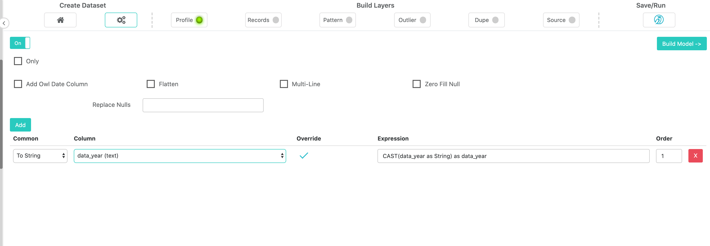
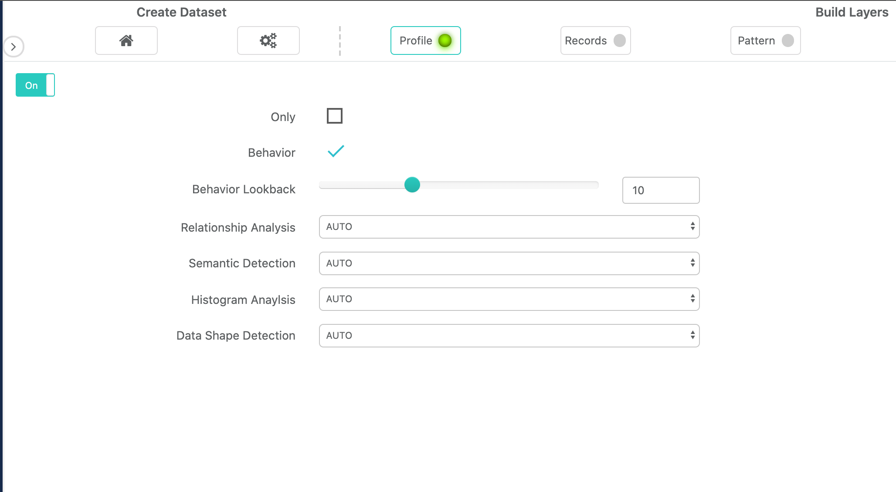
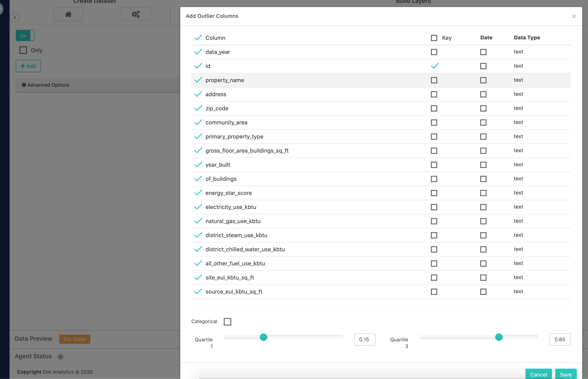
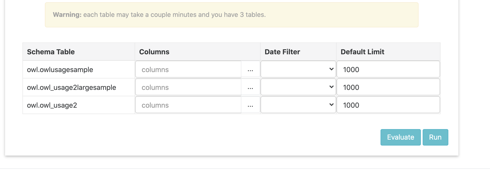

# Explorer 2

## Getting Started

This page can be accessed by clicked the Explorer option, within the compass icon 


This is being released as a tech preview and supports JDBC sources


## Select Your Data Source

## Create a new OwlCheck by clicking +Create OwlCheck

#### **View Data is an interactive option to run queries and explore the data**

#### The bar chart icon will take you to a profile page of the dataset created prior to Explorer 2 

## Select The Scope and Define a Query

#### Pick Date Column if your dataset contains an appropriate time filter 

#### Click Build Model -&gt; to Save and Continue 

## Transform Tab \(optional\)

#### Click Build Model -&gt; to Save and Continue 

## Profile

#### Click Save to and Click Records to Continue 

## Records

#### This should be applied to low cardinality columns 

#### Click Save to and Click Pattern to Continue 

## Pattern \(optional\)

Toggle on Pattern to enable this layer

Click +Add to define a group and series of columns 

#### Click Save to and Click Outlier to Continue 

## Outlier \(optional\)

#### Click Save to and Click Dupe to Continue 

## Dupe \(optional\)

#### Click Save to and Click Source to Continue 

## Source \(optional\)

Navigate to the source dataset

Click Preview to interlace the columns

Manually map the columns by dragging left to right or deselect columns 

#### Click Save to and Click Save/Run to Continue 

## Run

Select an agent

Click Estimate Job

Click Run to start the job

## **AutoProfile**

**AutoProfile** allows you to select a set of databases and tables to quickly be cataloged. Each selected table will be profiled and added to the Owl Catalog via the selected agent. Various parameters like Alerts, Job Schedules, limits, and more can also be set.

‌When you expand a datasource in the **Explorer** page, you're given a list of possible databases and their associated tables. **AutoProfile** is triggered when you select the ones you want and hit scan. This will take you to a separate page that allows you to configure the various AutoProfile parameters.

A SparkSubmit will be launched for each table, so make sure the agent configuration is reasonable and the box has enough resources to handle each job.

**Global Parameters**

 **Histogram** and **Correlation**: Enable or Disable

 **PushDown**: Set metrics that will be run against the entire table, ignoring limit values.

 **Default Limit**: The default row limit to set for each table to be scanned.

 **Batch Size**: The number of concurrent SparkSubmit jobs the agent will be allowed to run.

 **Scan and Schedule** : Enable scheduling.

 **Alert**: Enable email alerts.

 **Agent**: The agent under which jobs will run.

\*‌\*Per Table Parameters\*\*

 **Columns**: The columns to select from \(if none are specified, we assume all columns to be selected\).

 **Date Filter**: The date column to be used as the `runDate` parameter when the job runs.

 **Default Limit**: Per table limits.

