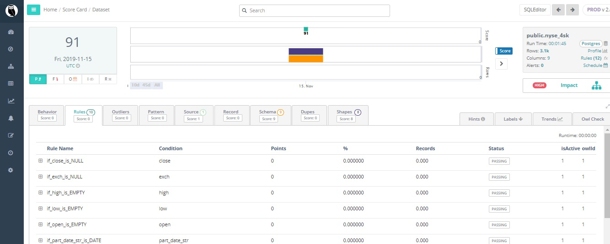

# Summary

## **Click or Code **

Collibra DQ offers easy to use no (low) code options for getting started quickly. Alternatively, more technical users may prefer programmatic APIs.

## **Core Components**

Collibra DQ offers a full DQ suite to cover the unique challenges of each dataset.&#x20;

**9 Dimensions of DQ**

1. Behaviors - Data observability
2. Rules - SQL-based rules engine
3. Schema - When columns are added or dropped
4. Shapes - Typos and Formatting Anomalies
5. Duplicates - Fuzzy matching, Identify similar but not exact entries
6. Outliers - Anomalous records, clustering, time-series, categorical
7. Pattern - Classification, cross-column & parent/child anomalies&#x20;
8. Record - Deltas for a given column(s)
9. Source - Source to target reconciliation

[Check out our videos to learn more](https://www.youtube.com/channel/UCKMcJ5NRiCDZQxBvSsVtTXw/videos)

## **Behavior **

**Imagine a column going null, automatic row count checks - does your data behave/look/feel the same way it has in the past.**

## **Rules**

**Assures only values compliant with your data rules are allowed within a data object. **

## **Schema **

**Columns add or dropped.**

## **Shapes**

**Infrequent formats.**

.jpg>)

## Dupes&#x20;

**Fuzzy matching to identify entries that have been added multiple times with similar but not exact detail.**

## **Outliers**

**Data points that differ significantly from other observations.**

## **Pattern**

**Recognizing relevant patterns between data examples.**&#x20;

## **Source**

**Validating source to target accuracy.**

## **Record**

**Deltas for a given column. **

##
