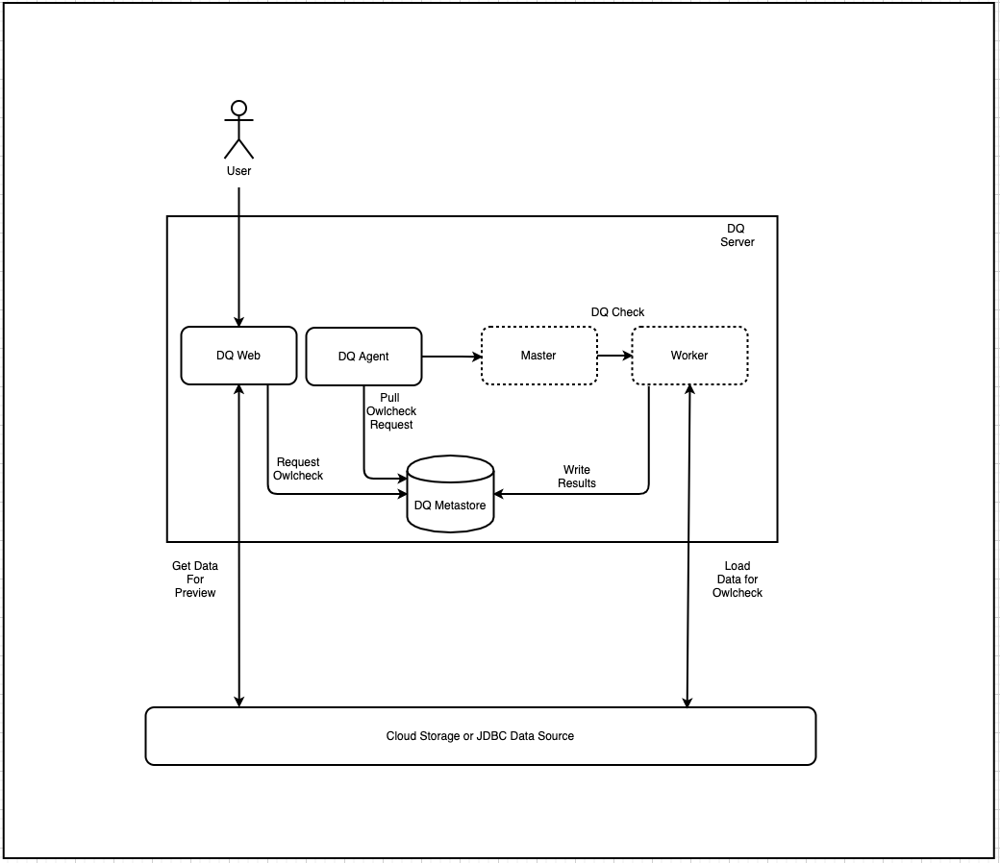
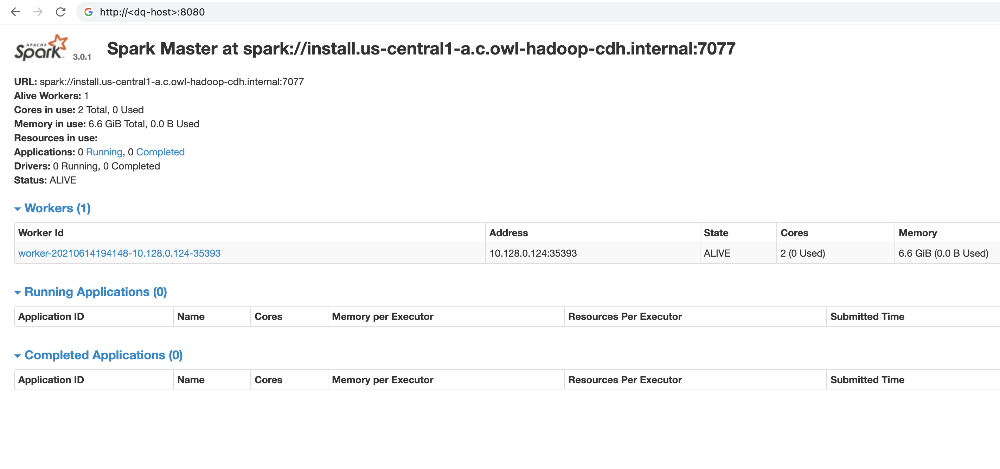
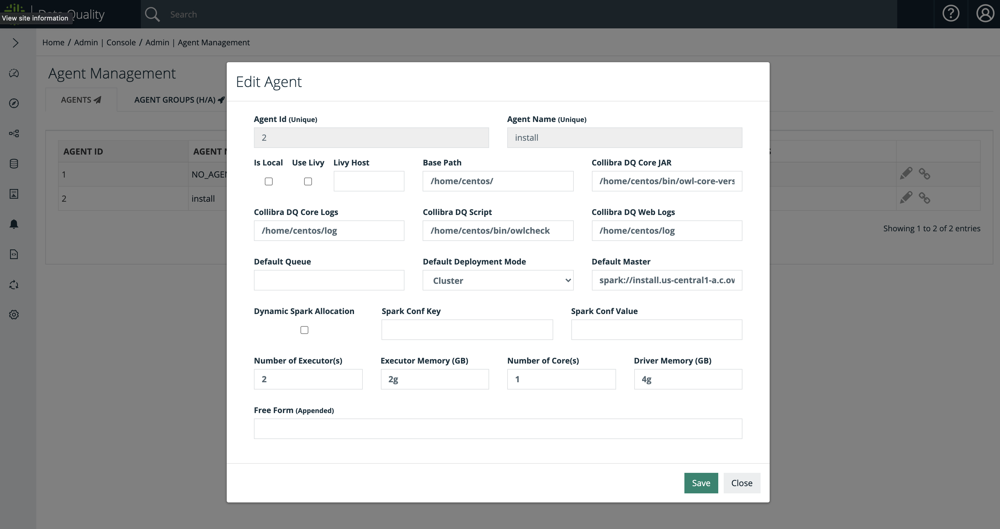
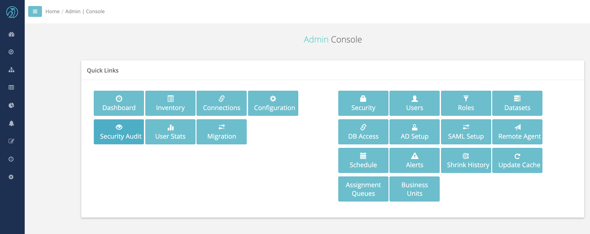
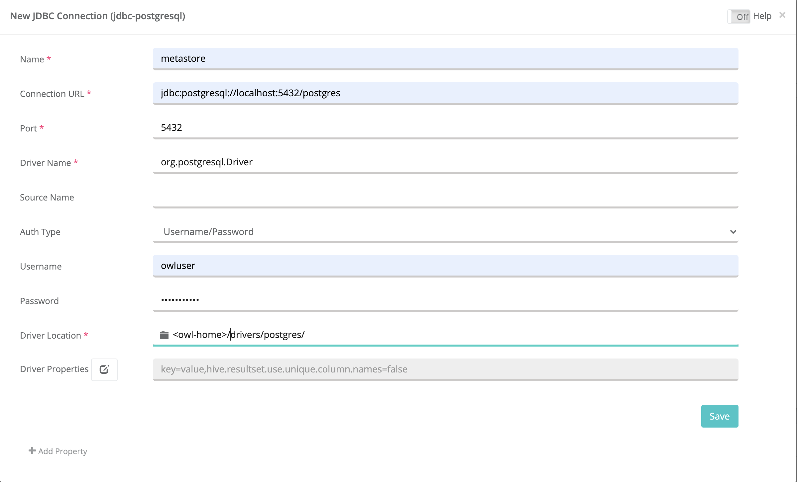
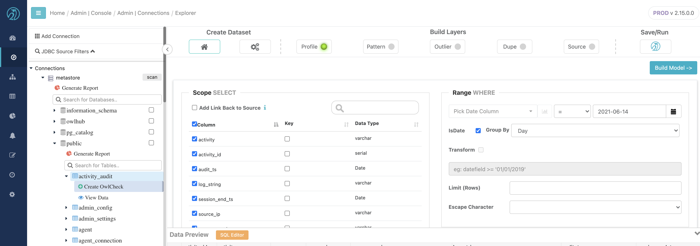

# Full Standalone Install

When large scale and high concurrency checks are not required, DQ can be installed and operated entirely on a single host. In this mode, DQ will leverage a **Spark Standalone pseudo cluster** where the master and workers run and use resources from the same server. DQ also requires a Postgres database for storage and Java 8 for running the DQ web application. It is possible to install each of the Spark, Postgres, and Java 8 components separately and install DQ on top of existing components. However, we offer a full installation package that installs these components in off-line mode and install DQ in one server.



## Setup Tutorial Assumptions

We assume that a server running Centos 7 or RHEL 7 is setup and ready to install DQ in the home directory. There is no requirement for DQ to be installed in the home directory, but the DQ Full Installation script may lead to permission-denied issue on local Postgres installation. If so, please adjust your directory permission to allow the installation script a write access to the Postgres data folder.

This tutorial assumes that you are installing DQ on a brand new compute instance on Google Cloud Platform. Google Cloud SDK setup with proper GCP permission is assumed. This is optional, as you are free to create Full Standalone Installation setup on any cloud service provider or on-premise.

Please refer to the _**GOAL**_ ****paragraph for the intended outcome of each step and modify accordingly


The full install package supports Centos 7 and RHEL 7. If another OS flavor is required, please follow the basic install process.


```text
# Create new GCP Compute Instance named "install"
gcloud compute instances create install \
    --image=centos-7-v20210701 \
    --image-project=centos-cloud \
    --machine-type=e2-standard-4

# SSH into the instance as user "centos"
gcloud compute ssh --zone "us-central1-a" --project "gcp-example-project" "centos@full-standalone-installation"
```


**GOAL**

Create a new compute instance on cloud provider \(if applicable\)

Access the server where DQ will be installed. 


## Download DQ Full Package

Download full package tarball using the signed link to the full package tarball provided by the DQ Team. Replace `<signed-link-to-full-package>` with the link provided.

```text
# Go to home directory
cd ~/ 

# Download & untar
curl -o dq-full-package.tar.gz "<signed-link-to-full-package>"
tar -xvf dq-full-package.tar.gz

# Clean-up unnecessary tarball (optional)
rm dq-full-package.tar.gz
```


**GOAL**

Download the full package tarball and place it in the home directory. Download via `curl` or upload directly via FTP.


## Install DQ + Postgres + Spark

First set some variables for `OWL_BASE` \(where to install DQ. In this tutorial, you are already in the directory that you want to install\), `OWL_METASTORE_USER` \(the Postgres username used by DQ Web Application  to access Postgres storage\), and `OWL_METASTORE_PASS` \(the Postgres password used by DQ Web Application  to access Postgres storage\). 

```text
# base path that you want owl installed. No trailing
export OWL_BASE=$(pwd)

export OWL_METASTORE_USER=postgres
export OWL_METASTORE_PASS=password
```


The default username and password for Postgres storage is `postgres`/`password` , as the installation script takes these default values. If you want to change these values, you must install Postgres separately and configure Postgres permissions independently. If so, skip this step in lieu of the next step using external Postgres setup.


`dq-package-full.tar.gz` contains installation packages for Java 8, Postgres 11, and Spark. There is no need to install these components. These components are in `$(pwd)/package/install-packages` .


One of the files extracted from the tarball is `setup.sh`. This script installs DQ and the required components. If a component already exist \(e.g. Java 8 is already installed and `$JAVA_HOME` is set\), then that component is not installed \(e.g. Java 8 installation is skipped\). 

To control which components are installed, use `-options=...`parameter. The argument provided should be comma-delimited list of components to install \(valid inputs: `spark`, `postgres`, `owlweb`, and `owlagent`. `-options=postgres,spark,owlweb,owlagent` means "install Postgres, Spark pseudo cluster, Owl Web Application, and Owl Agent". Note that Java is not part of the options. If Java 8 installation is automatically checked and installed/skipped depending on availability. You must at minimum specify `-options=spark,owlweb,owlagent` if you independently installed Postgres or using an external Postgres connection.

```text
# The following installs PostgresDB locally as part of OwlDQ install
./setup.sh \
    -owlbase=$OWL_BASE \
    -user=$OWL_METASTORE_USER \
    -pgpassword=$OWL_METASTORE_PASS \
    -options=postgres,spark,owlweb,owlagent
```


If prompted to install Java 8 because you do not have Java 8 installed, accept to install from local package.



When prompted for where to install Postgres like:

```text
Postgres DB needs to be intialized. Default location = <OWL_BASE>/postgres/data
to change path please enter a FULL valid path for Postgres and hit <enter>
DB Path [ <OWL_BASE>/owl/postgres/data ] = 
```

If the data files for the Postgres database need to be hosted at a specific location, provide it during this prompt. **Make sure the directory is writable**. Otherwise, just press &lt;Enter&gt; to install the data files into `$OWL_BASE/owl/postgres/data`.


If no exceptions occurred, then the process will complete with the following output.

```text
installing owlweb
starting owlweb
starting owl-web
installing agent
not starting agent
install complete
please use owl owlmanage utility to configure license key and start owl-agent after owl-web successfully starts up
```


**GOAL**

Specify `OWL_BASE` path where DQ is installed to and install DQ Web with Postgres and Spark linked to DQ Agent \(**all files will be in `$OWL_BASE/owl` sub-directory**\). The location of `OWL_BASE` and Postgres are configurable, but we advise you to take the defaults.


## Install DQ + Spark and use existing Postgres \(advanced\)


We only recommend this for advanced DQ Installer


If you already installed DQ from the previous step, then skip this step. This is only for those who want to use external Postgres. If you have an existing Postgres installation, then everything in the previous step applies except the Postgres data path prompt and the `setup.sh` command

Refer to the above step for details on what `OWL_BASE`, `OWL_METASTORE_USER` , and `OWL_METASTORE_PASS` are.

```text
# base path that you want owl installed. No trailing
export OWL_BASE=$(pwd)

export OWL_METASTORE_USER=postgres
export OWL_METASTORE_PASS=password
```

then run the following installation script. Note the missing "postgres" in `-options` and new parameter `-pgserver`. This `-pgserver` could point to any URL that the standalone instance has access to.

```text
# The following does not install PostgresDB and 
# uses existing PostgresDB server located in localhost:5432 with "postgres" database
./setup.sh \
    -owlbase=$OWL_BASE \
    -user=$OWL_METASTORE_USER \
    -pgpassword=$OWL_METASTORE_PASS \
    -options=spark,owlweb,owlagent \
    -pgserver="localhost:5432/postgres"
```

The database named `postgres` is used by default as DQ metadata storage. Changing this database name is out-of-scope for Full Standalone Installation. Contact DQ Team for help.

## Verify DQ and Spark Installation

The installation process will start the DQ Web Application. This process will handle initializing the Postgres metadata storage schema in Postgres \(under the database named `postgres`\). This process must complete successfully before the DQ Agent can be started. Wait approximately 1 minute for the Postgres metadata storage schema to be populated. If you can access DQ Web using `<url-to-dq-web>:9000` using a Web browser, then this means you have successfully installed DQ.


Next, verify that the Spark Cluster has started and is available to run DQ checks using `<url-to-dq-web>:`8080 Take note of the Spark Master url \(starting with `spark://...`\). This will be required during DQ Agent configuration.



## Set License Key

In order for DQ to run checks on data, the DQ Agent must be configured with a license key. Replace `<license-key>` with a valid license key provided by the DQ Team.

```text
cd $OWL_BASE/owl/bin
./owlmanage.sh setlic=<license-key>

# expected output:
# > License Accepted new date: <expiration-date>
```

## Set DQ Agent Configuration

Next, start the DQ Agent process to enable processing of DQ checks.

```text
cd $OWL_BASE/owl/bin
./owlmanage.sh start=owlagent
```

Once the DQ Agent starts, it needs to be configured in DQ Web in order to successfully submit jobs to the local Spark \(pseudo\) cluster.

Login to DQ Web and navigate to Admin Console.


From the Admin Console, click on the Remote Agent tile.


The newly created agent should be agent \#2. Click on the pencil icon to edit.


Edit the following parameters in DQ Agent \#2. See [Agent Configuration Parameters](https://docs.owl-analytics.com/installation/agent-configuration#agent-configuration-parameters) for details.

* The new agent has been setup with the default path `/opt/owl` as `$OWL_BASE` path instead of our actual `$OWL_BASE`.  Replace all occurrence of `/opt/owl` with your `$OWL_BASE`in **Base Path**, **Collibra DQ Core JAR**, **Collibra DQ Core Logs**, **Collibra DQ Script**, and **Collibra DQ Web Logs**.
* Replace **Default Master** value with the Spark URL from step 2
* Replace **Default Client Mode** to "Cluster"
* Replace **Number of Executors\(s\)**, **Executor Memory \(GB\)**, **Driver Memory \(GB\)** to a reasonable default \(depending on how large your instance is\)




## Run Test DQ Check

Click on the Connections Tile \(top row, left side\) to navigate to the Connection configuration page.



Click on the Postgres connection template, configure the test connection, and click save.



Before proceeding to create the run a test DQ check, the DQ Agent must be given rights to run DQ checks against the new JDBC connection. Navigate back to the Admin Console, and click the "Remote Agent" tile. On the left side of the screen, select the chain link icon next to the agent that was configured during the installation process. Double click the "metastore" connection from the left text area. Click the "Update" button to save the configuration.


Click the compass icon in the navigation pane to navigate to the Explorer Page. Click on the "metastore" connection, select the "public" schema, and then select the first table in the resulting list of tables. Once the preview and scope tab comes up, click "Build Model". When the Profile page comes up, click the "Run" button.



On the Run page, click the "Estimate Job" button, acknowledge the resource recommendations, and then click the "Run" button.


Click the clock icon in the navigation pane to navigate to the Jobs Page. Wait 10 seconds and then click refresh several times with a few seconds in between clicks. The test DQ check should show and progress through a sequence of activities before settling in "Finished "status.


