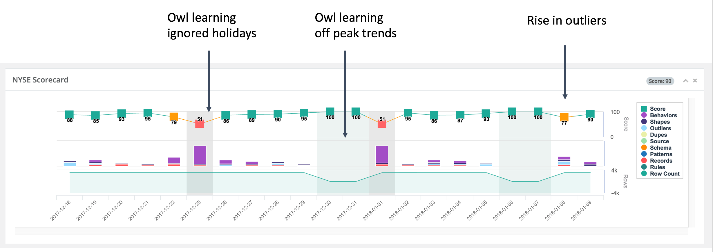

# Dataset Scorecard

Scorecards allow you to visualize the health and consistency of a dataset over time. Owl will highlight macro and micro trends, e.g weekend loads vs weekday loads or behavioral item changes per day, and display them on the dataset scorecard.

## DQ Over Time, Drill-In and Roll-Up

Data quality isn't a one time check or once a year project. Data is the life blood flowing through your organization. It's mandatory to know how your data is behaving right now, yesterday and over time to gain an understanding of the trends. For insights to be meaningful we need to see both the lowest granularity and the big picture. Owl's approach lets you drill all the way into the exact moment the issue arose as well as zoom out to see how your data is behaving month to month. This makes Owl useful at many different levels in your organization's heirarchy- a Data Steward might be more concerned with a recent change in data and want to correct it using service now immediately, whereas a Chief Data Officer might be more concerned with the health of the organization's data overall.

