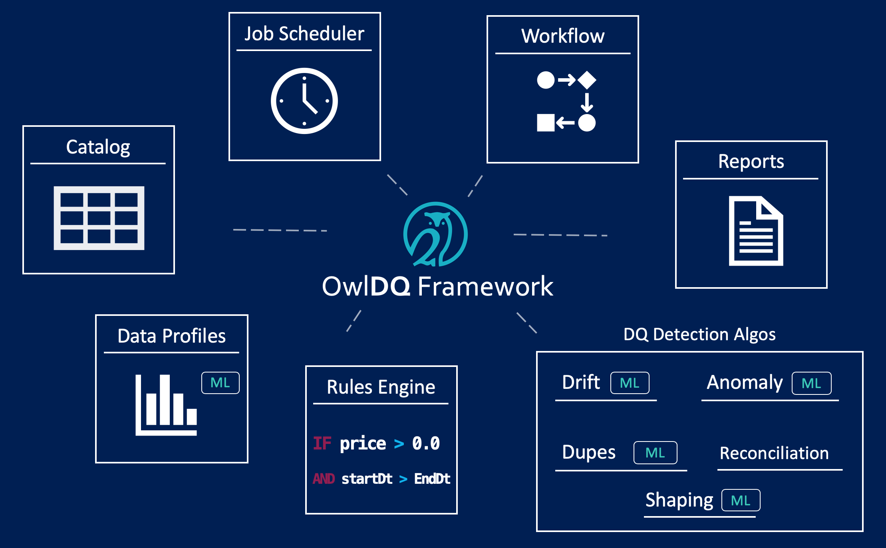

# Bank Loans

It is common for banks to lend money in return for monthly payments with interest.  However to do so a bank must make sure that the applications are valid and wellformed to begin the underwriting and approval process.  Below we will apply some basic lending concepts to OwlDQ. 

1. Credit Score Validation
2. SSN Validation
3. Loan to Value Validation
4. Interest Rate Validation
5. Duplicate Loan Applications
6. Loan Amount Validation
7. Loan Completeness Validation


## 1. Credit Score

| Business Check                                                             | OwlDQ Feature  | Manual vs Auto                   |
| -------------------------------------------------------------------------- | -------------- | -------------------------------- |
| Is the credit score a whole number                                         | BEHAVIOR       | AUTO                             |
| <p>Is the credit score within a valid range </p><p>(between 300 - 850)</p> | RULE           | credit_score between 300 and 850 |
| Is the credit score NULL or Missing                                        | BEHAVIOR       | AUTO                             |

##  2. SSN Validation

| Business Check                       | OwlDQ Feature |                              |
| ------------------------------------ | ------------- | ---------------------------- |
| Is a valid formatted SSN             | RULE          | AUTO-SSN detection           |
| SSN is PII                           | SENSITIVITY   | AUTO-SSN labeled             |
| Is the SSN NULL or Missing           | BEHAVIOR      | AUTO                         |
| Does the SSN belong to the Applicant | PATTERN       | SSN -> first_name, last_name |

## 3. Loan to Value 

| Business Check                                                            | OwlDQ Feature |                          |
| ------------------------------------------------------------------------- | ------------- | ------------------------ |
| <p>Is Loan amount and </p><p>asset value (home or auto) valid numbers</p> | BEHAVIOR      | AUTO                     |
| 95% loan to value ratio to approve                                        | RULE          | loan / asset_value < .95 |

## 4. Interest Rate

| Business Check                                                                                      | OwlDQ Feature |                                                                                                                       |
| --------------------------------------------------------------------------------------------------- | ------------- | --------------------------------------------------------------------------------------------------------------------- |
| <p>Interest rate between </p><p>min and max allowable range </p><p>for the loans credit rating.</p> | RULE COMPLEX  | <p>loan l join rates r on l.credit_rating = r.credit_rating </p><p>where l.rate between r.min_rate and r.max_rate</p> |

## 5. Duplicate Loan Applications

Can't give someone the same loan twice!

| Business Check                            | OwlDQ Feature | Manual vs Auto                |
| ----------------------------------------- | ------------- | ----------------------------- |
| Ensure we don't issue the same loan twice | DUPE          | first_n, last_n, SSN, Address |

## 6. Loan Amount

| Business Check                                                                     | OwlDQ Feature | Manual vs Auto                        |
| ---------------------------------------------------------------------------------- | ------------- | ------------------------------------- |
| Loan Amount within lendable range                                                  | OUTLIER       | AUTO                                  |
| <p>Loan Amount within lendable range </p><p>only lend money between 50K and 3M</p> | RULE          | loan_amount between 50000 and 3000000 |

### Resulting OwlCheck

```bash
-lib "/home/opt/owl/drivers/postgres" \
-cxn postgres-gcp \
-q "select * from public.loan_risk_grade where last_pymnt_d = '2019-04-01'" \
-key member_id -alias loan_risk \
-ds public.loan \
-rd "2019-04-01" \
-dl -loglevel INFO \
-h 10.142.0.29:5432/owltrunk \
-numexecutors 10 -executormemory 1g -drivermemory 4g \
-master yarn -deploymode cluster \
-sparkprinc user2@CW.COM \
-sparkkeytab /tmp/user2.keytab -tbin MONTH \
-dupe -dupeinc purpose -fpgon -fpgkey grade \
-fpginc grade,sub_grade -fpglb 365 -fpgdc last_pymnt_d \
-record member_id -dupecutoff 60 -dupepermatchupperlimit 99 
```

## Which components did we use?

We made use of Profiles, Duplicates, Outliers and Rules in this example.  The experiments were automatically cataloged and put on a job scheduler.  The next time a loan issue arises we will be able to take remediation action using the workflow Q.  Over time we can see how the bank loan program is running via the report section. 



## Files that can be used to replicate this example


Interest Rates CSV



Loan Data CSV

